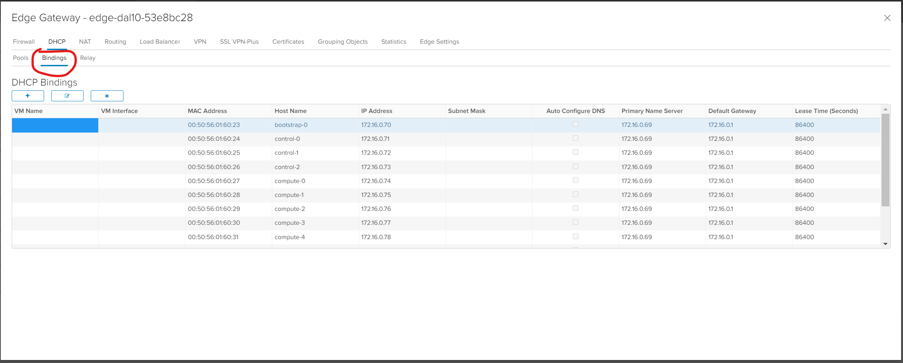

# OpenShift 4.6 UPI Deployment with Static IPs

**Unfornately, the new capability of OpenShift 4.6 to pass Static IP's thru the ignition string don't currently work in the VCD environment because the ignition strings depend on VMWare vm_advanced_config parameters, which aren't available in VCD. A bugzilla has been opened ([Bugzilla ID 1913791](https://bugzilla.redhat.com/show_bug.cgi?id=1913791)) but its really a VCD issue. To get around this issue, the best approach is to come up with a scheme for DHCP reservations for the OpenShift servers based on MAC address. Today, this is done manually by going into the Edge Gateway Services definition and going into the DHCP Bindings section.  VCD doesn't allow terraform creation of the Edge Gateway DHCP Bindings so I am trying to figure out the best way to generate dhcpd.conf file to contain the DHCP Reservation and install a dhcpd server on the LB (alongside the DNS and HAProxy). I've already figured out how to get the dhcp server out there, I just need to generate the dhcpd.conf file. Its a little problematic in terraform so I may just use a shell script (if someone has the time to write one)**

The benefits of this code vs. the VCD Toolkit are:
  - vcd toolkit doesn't update LB haproxy.cfg file properly if you change the number of nodes. You have to manually update.
  - This code checks for outstanding CSR's and automatically approves them so no more manual step.
  - Install doesn't require multiple steps of running scripts, then terraform then more scripts. Just set variables, run terraform, then start VM's.





Deploy OpenShift 4.6 and later using static IP addresses for CoreOS nodes. The `ignition` module will inject code into the cluster that will automatically approve all node CSRs.  This runs only once at cluster creation.  You can delete the `ibm-post-deployment` namespace once your cluster is up and running.

**NOTE**: This requires OpenShift 4.6 or later to deploy, if you're looking for 4.5 or earlier, take a look at the `pre-4.6` [branch](https://github.com/ibm-cloud-architecture/terraform-openshift4-vmware/tree/pre-4.6)

**NOTE**: Requires terraform 0.13 or later.

## Architecture

OpenShift 4.6 User-Provided Infrastructure


## Prereqs

1. [DNS](https://docs.openshift.com/container-platform/4.6/installing/installing_vsphere/installing-vsphere.html#installation-dns-user-infra_installing-vsphere) needs to be configured ahead of time
    - If you're using the helper vm for internal DNS, the only external DNS entries required are:
      - api.`cluster_id`.`base_domain`
      - *.apps.`cluster_id`.`base_domain`
    - Point both of those DNS A or CNAME records to either your LoadBalancers or the public IP address of the CoreOS LoadBalancer VM
2. [CoreOS OVA](http://mirror.openshift.com/pub/openshift-v4/dependencies/rhcos/) must be uploaded to a VCD Catalog as a template.

## Installation Process
## Ordering
You will order a **VMware Solutions Shared** instance in IBM Cloud(below).  When you order a new instance, a **DataCenter** is created in vCloud Director.  It takes about an hour.

#### Procedure:
* in IBM Cloud > VMWare > Overview,  select **VMWare Solutions Shared**
* name your virtual data center
* pick the resource group.  
* agree to the terms and click `Create`
* then in VMware Solutions > Resources you should see your VMWare Solutions Shared being created.  After an hour or less it will be **ready to use**

### First time setup
* click on the VMWare Shared Solution instance named from the Resources list
* set your admin password, and save it
* click the button to launch your  **vCloud Director console**
* we recommend that you create individual Users/passwords for each person accessing the environment
* Note: You don't need any Private network Endpoints unless you want to access the VDC from other IBM Cloud accounts over Private network


## Choose an Image Catalog
We need a catalog of VM images to use for our OpenShift VMs.
Fortunately IBM provides a set of images that are tailored to work for OpenShift deployments.
To browse the available images:
* From your vCloud Director console, click on **Libraries** in the header menu.
* select *vApp Templates*
* There are 1 images in the list that we will be using:
  * rhcos OpenShift 4.6.8 - OpenShift CoreOS template
* If you want to add your own Catalogs and more, see the [documentation about catalogs](#about-catalogs)

## Networking
Much of the following is covered in general in the [Operator Guide/Networking](https://cloud.ibm.com/docs/vmwaresolutions?topic=vmwaresolutions-shared_vcd-ops-guide#shared_vcd-ops-guide-networking). Below is the specific network configuration required.

### Create private networks

Create a network where we will install VMs and OCP.
* Go to main menu > Networking > Networks and select **NEW** or **ADD**
  - Select Network Type: `Routed`
  - General:
    - Name:  **ocpnet**
    - Gateway/CIDR: **172.16.0.1/24**
    - Shared - leave it toggled off
  - Edge:  
    - connect to your ESG
    - Interface Type:  **Internal**  (changed from **Distributed** temporarily due to a bug in VMWare. Not sure if its really necessary to change back? )
    - Guest Vlan Allowed: **no**
  - Static IP Pools:
     - convenient for establishing a range that you manually assign from.   **172.16.0.10 - 172.16.0.18**
  - DNS: Use Edge DNS -  toggled off.  Set primary DNS to 172.16.0.10 which is where we will put the Bastion VM.  This is the DNS that will be used by default for VMs created with static or pool based IP addresses.


### Configure edge networking
Configure the Edge Service Gateway (ESG) to provide inbound and outbound connectivity.  For a network overview diagram, followed by general Edge setup instruction, see: https://cloud.ibm.com/docs/vmwaresolutions?topic=vmwaresolutions-shared_vcd-ops-guide#shared_vcd-ops-guide-create-network

Each vCloud Datacenter comes with 5 IBM Cloud public IP addresses which we can use for SNAT and DNAT translations in and out of the datacenter instance.  VMWare vCloud calls these `sub-allocated` addresses.
The sub-allocated address are available in IBM Cloud on the vCloud instance Resources page.
Gather the following information that you will need when configuring the ESG:
* Make a `list of the IPs and Sub-allocated IP Addresses` for the ESG.       
* Go to main menu > Networking > Edges,  and Select your ESG
  - Go to `Networks and subnets` and copy down the `Participating Subnets` of the `tenant-external` and `servicexx` external networks. (we will need this info later)
    - the tenant-external network allows external internet routing
    - the service network allows routing to IBM Cloud private network /services

For the following steps go to main menu > Networks > Edges > Select your ESG and select **SERVICES**

See also https://cloud.ibm.com/docs/vmwaresolutions?topic=vmwaresolutions-shared_vcd-ops-guide#shared_vcd-ops-guide-enable-traffic

**Note:** make modifications by editing the various columns on the screen as instructed below.

#### Outbound from the OCP private network to public Internet
1. Firewall Rule
    - go to the Firewall tab and select '+' to add
      - Name: **ocpnet**
      - Source: Select the '+'
        - select 'Org Vdc Networks' from the objects type list
        - select 'ocpnet' from list and then click '->' and 'Keep'
      - Destination: skip. (this will become "any" in the Firewall Rules screen)
     - Select: 'Save changes'

2. NAT
    - go to the NAT tab and select '+SNAT RULE' in the NAT44 Rules
      - Applied On: **<your>-tenant-external**
      - Original Source IP/Range: **172.16.0.1/24**
      - Translated Source IP/Range: pick an address not already used address from the sub-allocated network IPs
      - Description: **ocpnet outbound**

#### Outbound from OCP private network to IBM Cloud private network
[Official instruction to connect to the IBM Cloud Services Private Network](https://cloud.ibm.com/docs/vmwaresolutions?topic=vmwaresolutions-shared_vcd-ops-guide#shared_vcd-ops-guide-enable-access).  Our shorthand setup steps:
1. Firewall Rule
    - go to the Firewall tab and select '+' to add
      - Name: **ocpnet cloud-private**
      - Source: Select the '+'
        - select 'Org Vdc Networks' from the objects type list
        - select 'ocpnet' from list and then click '->' and 'Keep'
      - Destination: Select the '+'
        - select 'Gateway Interfaces' from the objects type list
        - select **<your>-service-nn** network from list and then click '->' and 'Keep'. (this will become "vnic-1" in the Firewall Rules screen)
     - Select: 'Save changes'

2. NAT
    - go to the NAT tab and select '+SNAT RULE' in the NAT44 Rules
      - Applied On: **<your>-service-nn**
      - Original Source IP/Range: **172.16.0.1/24**
      - Translated Source IP/Range: enter the `Primary IP` for the service network interface copied from the ESG settings (Or select it from the dropdown list)
      - Description: **access to the IBM Cloud private**

#### Inbound config to the bastion on OCP private network
We need to configure DNAT so that we have ssh access the bastion VM from public internet:
  - We will use  172.16.0.10 address for bastion VM
1. Firewall Rule
    - go to the Firewall tab and select '+' to add
      - Name: **bastion**
      - Destination: tap the 'IP' button
        - choose an available IP address from your list of  `public/sub-allocated IPs` and enter it
      - Service: Protocol: `TCP` Source port: `any` Destination port: `22`
     - Select: 'Save changes'

2. NAT
    - go to the NAT tab and select '+DNAT RULE' in the NAT44 Rules
      - Applied On: **your-tenant-external**
      - Original Source IP/Range: enter the same public IP that you used in the firewall rule
      - Translated Source IP/Range: **172.16.0.10**
      - Description: **access to bastion host**

#### Inbound config to OCP Console
Configure DNAT so that you have https access to the console from public internet:
1. Firewall Rule
    - go to the Firewall tab and select '+' to add
      - Name: **ocpconsole**
      - Destination: Select the 'IP'
        - choose an available IP address from your list of  `public/sub-allocated IPs` and enter it
      - Service: Protocol: `any`
     - Select: 'Save changes'

2. NAT
    - go to the NAT tab and select '+DNAT RULE' in the NAT44 Rules
      - Applied On: **your-tenant-external**
      - Original Source IP/Range: choose an available IP address from your list of  `public/sub-allocated IPs` and enter it
      - Translated Source IP/Range: **172.16.0.19** (This is the IP address we will use for the Load Balancer)
      - Description: **access to ocp console**

#### Setup DHCP
* Our Edge gateway will provide DHCP services.  On the Edge > DHCP, click + and configure DHCP with the following settings:
    ```
    IPRange: 172.16.0.150-172.16.0.245
    Primary Nameserver: 172.16.0.10 (bastion)
    AutoConfig DNS: no
    Gateway: 172.16.0.1
    Netmask: 255.255.255.0
    Lease: 86400
    ```
* Toggle DHCP Service on

* TODO - should document creating a simple VM or 2 for testing.
* check if DHCP is up:  From a VM `sudo nmap --script broadcast-dhcp-discover`
    This should return you a DHCPOFFER.  If not, DHCP is not configured and enabled on the edge.  Confirm the ip offered, netmask, router/gateway, and DNS server.  For example:

```
Starting Nmap 6.40 ( http://nmap.org ) at 2020-08-25 15:38 EDT
Pre-scan script results:
| broadcast-dhcp-discover:
|   IP Offered: 172.16.0.151
|   DHCP Message Type: DHCPOFFER
|   Server Identifier: 169.254.1.73
|   IP Address Lease Time: 0 days, 0:05:00
|   Subnet Mask: 255.255.255.0
|   Router: 172.16.0.1
|_  Domain Name Server: 172.16.0.10
```


## Create and configure Bastion VM
The Bastion VM hosts the vcd_toolkit_for_openshift and is the VM where we launch installations from.  The VM also hosts **DNS service**, and an **HTTP server** through which the Ignition configuration files are provided to Bootstrap during installation.

Go to Virtual Machines > **New VM**
Name: **bastion**
  - **From Template**
  - Select **vm-redhat8** (todo - have to test bastion setup instructions with redhat8, we know it works but have not double checked the instructions.  If you have a problem please open an issue)

After the VM is created, connect it to your network:
 - from Virtual Machines, select bastion VM
  - Details > Hardware > **NICs**
    - select **Connected**
    - Network = **ocpnet**
    - IP Mode = **Static - Manual**
    - IP Address **172.16.0.10**
    - Click **Save**  

#### Enable Redhat entitlement
  * You need to enable RedHat entitlement so that you can use yum.
  * ssh to bastion and execute the [steps in bullet 3 here](https://cloud.ibm.com/docs/vmwaresolutions?topic=vmwaresolutions-shared_vcd-ops-guide#shared_vcd-ops-guide-public-cat-rhel) to register the VM
  * **NOTE** if later on you are unable to yum install packages, you may need to `attach` to the subscription manager
```
    subscription-manager attach --auto
```
  * For more info see [Subscription Manager Cheatsheet](https://access.redhat.com/sites/default/files/attachments/rh_sm_command_cheatsheet_1214_jcs_print.pdf)

#### Install and configure DNS based on dnsmasq
We will use DNSMasq to be our local DNS server.  We need a local DNS server to resolve names for the nodes (VMs) in our OpenShift Cluster.
We also need the local DNS server to forward requests for names outside the local network to a public name server.
Also recall that we configured the Edge to be our DHCP server.

First, install dnsmasq:   
`yum install dnsmasq`

dnsmasq is configured in /etc/dnsmasq.conf.  We need to make the following updates:
- Turn off the dnsmasq DHCP service by adding this line:
  ```
  no-dhcp-interface=ens192
  ```
 - Configure dnsmasq to forward requests that it cannot resolve locally to an upstream DNS server. Add the following config:
  ```
  server=8.8.8.8
  server=8.8.4.4
  ```

 - Configure dnsmasq to listen on loopback, as well as ens192.  Add the following to the config:
  ```
  listen-address=127.0.0.1
  interface=ens192
  interface=lo
  ```
  (Alternatively this should work instead of the above 3 lines.  TODO which is better?)
    `listen-address=::1,127.0.0.1,172.16.0.10`

- Run the following command to see all the active configuration lines:
`grep -v -e '^#' -e '^$'  /etc/dnsmasq.conf`

```
  no-dhcp-interface=ens192
  server=8.8.8.8
  server=8.8.4.4
  listen-address=127.0.0.1
  interface=ens192
  interface=lo
  ```
- Enable and restart dnsmasq service:
    * `systemctl enable dnsmasq.service` # so that dnsmasq will start after reboot
    * `systemctl start dnsmasq.service`

Note:  /etc/resolv.conf needs to be configured so that all DNS requests go through dnsmasq.  The config will look like this.  TODO I think dnsmasq makes it so:
  ```
  cat /etc/resolv.conf
  # Generated by NetworkManager
  nameserver 172.16.0.10
  ```
 - Verify that dnsmasq is listening for DNS requests (and only DNS):
`netstat -aunp`
```
 ...
udp        0      0 0.0.0.0:53              0.0.0.0:*                           1202/dnsmasq         
```

- Verify that bastion is configured correctly as the nameserver, and that public names are resolved. We should get a valid address back, and the SERVER should be bastion (172.16.0.10):
```
dig ibm.com
...
;; Got answer:
...
;; ANSWER SECTION:
ibm.com.		21599	IN	A	129.42.38.10
...
;; SERVER: 172.16.0.10#53(172.16.0.10)
...
```
#### Install preReqs of the Terraform  and SimpleHTTP server:
  - `yum install unzip`
  - `yum install python3`
  - `yum install -y yum-utils`
  - `yum-config-manager --add-repo https://rpm.releases.hashicorp.com/RHEL/hashicorp.repo`
  - `yum install terraform`

#### Update firewall
Allow HTTP(port 80) and DNS(port 53) traffic into bastion.  Issue the following commands.  You should get `success` message from each:
```
firewall-cmd --add-port=80/tcp --zone=public --permanent
firewall-cmd --add-port=53/tcp --zone=public --permanent
firewall-cmd --add-port=53/udp --zone=public --permanent
firewall-cmd --reload
```
[More about firewalld](https://access.redhat.com/documentation/en-us/red_hat_enterprise_linux/7/html/security_guide/sec-using_firewalls#sec-Getting_started_with_firewalld)

#### Start HTTP Server
The HTTP Server is used by the bootstrap and other coreOS nodes to retrieve their ignition files.
* Important: start the server from / directory so that path to ignition files is correct!
* `cd /; nohup python3 -m http.server 80 &`
* Note: to see requests to the server `tail -f /nohup.out`


```bash
git clone https://github.com/slipsibm/terraform-openshift4-vmware
cd terraform-openshift4-vmware
```

Update your `terraform.tfvars` with your environment values.  See `terraform.tfvars.example`

```bash
terraform init
terraform plan
terraform apply
```

## terraform variables

| Variable                     | Description                                                  | Type | Default |
| ---------------------------- | ------------------------------------------------------------ | ---- | ------- |
| vcd_url               | url for the VDC api                    | string | https://daldir01.vmware-solutions.cloud.ibm.com/api |
| vcd_user                     | VCD username                                             | string | - |
| vcd_password             | VCD password                                             | string | - |
| vcd_vdc                      | VCD VDC name          | string | - |
| cluster_id                   | VCD Cluster where OpenShift will be deployed             | string | - |
| vcd_org   |  VCD Org from VCD Console screen |  string |   |
| rhcos_template | Name of CoreOS OVA template from prereq #2 | string | - |
| lb_template | VCD Network for OpenShift nodes                   | string | - |
| vcd_catalog   | Name of VCD Catalog containing your templates  | string  |  Public Catalog |
| vm_network | VCD Network for OpenShift nodes                   | string | - ||   |   |   |   |
| loadbalancer_network       | VCD Network for Loadbalancer/DNS VM                      | string | -                              |
| vm_dns_addresses           | List of DNS servers to use for your OpenShift Nodes          | list   | 8.8.8.8, 8.8.4.4               |
| base_domain                | Base domain for your OpenShift Cluster                       | string | -                              |
| machine_cidr | CIDR for your CoreOS VMs in `subnet/mask` format.            | string | -                              |
| bootstrap_ip_address|IP Address for bootstrap node|string|-|
| bootstrap_mac_address|MAC Address for bootstrap node|string|-|
| control_plane_mac_addresses|List of mac addresses for your control plane nodes|list|-|
| control_plane_count          | Number of control plane VMs to create                        | string | 3                |
| control_plane_memory         | Memory, in MB, to allocate to control plane VMs              | string | 16384            |
| control_plane_num_cpus| Number of CPUs to allocate for control plane VMs             |string|4|
| control_disk  | size in MB   | string  |  - |
| compute_ip_addresses|List of IP addresses for your compute nodes|list|-|
| compute_mac_addresses|List of MAC addresses for your compute nodes|list|-|
| compute_count|Number of compute VMs to create|string|3|
| compute_memory|Memory, in MB, to allocate to compute VMs|string|8192|
| compute_num_cpus|Number of CPUs to allocate for compute VMs|string|3|
| compute_disk  | size in MB   | string  |  - |
| storage_ip_addresses|List of IP addresses for your storage nodes|list|`Empty`|
| storage_mac_addresses|List of MAC addresses for your storage nodes|list|`Empty`|
| storage_count|Number of storage VMs to create|string|0|
| storage_memory               | Memory, in MB to allocate to storage VMs                     | string | 65536            |
| storage_num_cpus             | Number of CPUs to allocate for storage VMs                   | string | 16               |
| storage_disk  | size in MB must be min of 2097152 to install OCS   | string  |  2097152 |
| lb_ip_address                | IP Address for LoadBalancer VM on same subnet as `machine_cidr` | string | -                |
| loadbalancer_lb_ip_address   | IP Address for LoadBalancer VM for secondary NIC on same subnet as `loadbalancer_lb_machine_cidr` | string | -                |
| loadbalancer_lb_machine_cidr | CIDR for your LoadBalancer CoreOS VMs in `subnet/mask` format | string | -                |
| openshift_pull_secret        | Path to your OpenShift [pull secret](https://cloud.redhat.com/openshift/install/vsphere/user-provisioned) | string | -                |
| openshift_cluster_cidr       | CIDR for pods in the OpenShift SDN                           | string | 10.128.0.0/14    |
| openshift_service_cidr       | CIDR for services in the OpenShift SDN                       | string | 172.30.0.0/16    |
| openshift_host_prefix        | Controls the number of pods to allocate to each node from the `openshift_cluster_cidr` CIDR. For example, 23 would allocate 2^(32-23) 512 pods to each node. | string | 23               |
| openshift_version            | Version of OpenShift to install. 4.6 or later.               | string | 4.6              |
| create_loadbalancer_vm | Create the LoadBalancer VM and use it as a DNS server for your cluster.  If set to `false` you must provide a valid pre-configured LoadBalancer for your `api` and `*.apps` endpoints and DNS Zone for your `cluster_id`.`base_domain`. | bool | false |

## Let OpenShift finish the installation:
Once you power on the machines it should take about 20 mins for your cluster to become active. To debug see **Debugging the OCP installation dance** below.

- power on all the VMs in the VAPP.  Alternatively:
- change terraform template to power on the VMs: run `sed -i "s/false/true/" main.tf`
- To power on the VMs run `terraform apply --auto-approve`
- cd to authentication directory: `cd <clusternameDir>/auth`
    This directory contains both the cluster config and the kubeadmin password for UI login
- export KUBECONFIG= clusternameDir/auth/kubeconfig

  Example:   
   `export KUBECONFIG=/root/terraform-openshift-vmware/installer/stuocpvmshared1.stulipshires.com/auth/kubeconfig`
- If you want to watch the install, you can  
  `ssh -i artifacts/openshift_rsa core@<bootstrap ip>` into the bootstrap console and watch the logs. Bootstrap will print the jounalctl command when you login: `journalctl -b -f -u release-image.service -u bootkube.service`. You will see lots of messages (including error messages) and in 15-20 minutes, you should see a message about the bootstrap service completing. Once this happens, exit the bootstrap node.

  You can now watch the OpenShift install progress.

`oc get nodes`
```
 NAME                                  STATUS   ROLES    AGE   VERSION
 master-00.ocp44-myprefix.my.com   Ready    master   16m   v1.17.1+6af3663
 master-01.ocp44-myprefix.my.com   Ready    master   16m   v1.17.1+6af3663
 master-02.ocp44-myprefix.my.com   Ready    master   16m   v1.17.1+6af36
```

- Watch the cluster operators. Confirm the RH cluster operators are all 'Available'

`watch -n 5 oc get co`

```
NAME                                       VERSION   AVAILABLE   PROGRESSING   DEGRADED   SINCE
authentication                             4.5.22    True        False         False      79m
cloud-credential                           4.5.22    True        False         False      100m
cluster-autoscaler                         4.5.22    True        False         False      89m
config-operator                            4.5.22    True        False         False      90m
console                                    4.5.22    True        False         False      14m
csi-snapshot-controller                    4.5.22    True        False         False      18m
dns                                        4.5.22    True        False         False      96m
etcd                                       4.5.22    True        False         False      95m
image-registry                             4.5.22    True        False         False      91m
ingress                                    4.5.22    True        False         False      84m
insights                                   4.5.22    True        False         False      90m
kube-apiserver                             4.5.22    True        False         False      95m
kube-controller-manager                    4.5.22    True        False         False      95m
kube-scheduler                             4.5.22    True        False         False      92m
kube-storage-version-migrator              4.5.22    True        False         False      12m
machine-api                                4.5.22    True        False         False      90m
machine-approver                           4.5.22    True        False         False      94m
machine-config                             4.5.22    True        False         False      70m
marketplace                                4.5.22    True        False         False      13m
monitoring                                 4.5.22    True        False         False      16m
network                                    4.5.22    True        False         False      97m
node-tuning                                4.5.22    True        False         False      53m
openshift-apiserver                        4.5.22    True        False         False      12m
openshift-controller-manager               4.5.22    True        False         False      90m
openshift-samples                          4.5.22    True        False         False      53m
operator-lifecycle-manager                 4.5.22    True        False         False      96m
operator-lifecycle-manager-catalog         4.5.22    True        False         False      97m
operator-lifecycle-manager-packageserver   4.5.22    True        False         False      14m
service-ca                                 4.5.22    True        False         False      97m
storage                                    4.5.22    True        False         False      53m

```
#### Debugging the OCP installation dance

As noted above you power on all the VMs at once and magically OpenShift gets installed.  This section will explain enough of the magic so that you can figure out what happened when things go wrong. See Reference section below for deeper debug instructions

When the machines boot for the first time they each have special logic which runs scripts to further configure the VMs.  The first time they boot up using DHCP for network configuration.  When they boot, the "ignition" configuration is applied which switches the VMs to static IP, and then the machines reboot.  TODO how do you tell if this step failed?  Look at the VMs in VCD console to get clues about their network config?

Assuming Bootstrap VM boots correctly, the first thing it does is pull additional ignition data from the bastion HTTP server.  If you don't see a 200 get successful in the bastion HTTP server log within a few minutes of Bootstrap being powered on, that is a problem

Next Bootstap installs an OCP control plane on itself, as well as an http server that it uses to help the master nodes get their own cluster setup.  You can ssh into boostrap (ssh core@172.16.0.20) and watch the logs.  Bootstrap will print the jounalctl command when you login: `journalctl -b -f -u release-image.service -u bootkube.service` . Look carefully at the logs. Typical problems at this stage are:
  * bad/missing pull secret
  * no internet access - double check your edge configuration, run tyical ip network debug


## Configuration to enable OCP console login
- Get the console url by running `oc get routes console -n openshift-console`

`oc get routes console -n openshift-console`
```
 NAME      HOST/PORT                                                  PATH   SERVICES   PORT    TERMINATION          WILDCARD
 console   console-openshift-console.apps.ocp44-myprefix.my.com          console    https   reencrypt/Redirect   None
```

- Create Firewall Rule and DNAT using a Public IP in the Edge Gateway in VCD console. TODO instructions

- Add name resolution to direct console to the Public IP in /etc/hosts on the client that will login to the Console UI.
  As an example:
```
  1.2.3.4 console-openshift-console.apps.ocp44-myprefix.my.com
  1.2.3.4 oauth-openshift.apps.ocp44-myprefix.my.com
```

- From a browser, connect to the "console host" from the `oc get routes` command with https. You will need to accept numerous security warnings as the deployment is using self-signed certificates.
- id is `kubeadmin` and password is in `<clusternameDir>/auth/kubeadmin-password`


## Optional Steps:
### Add an NFS Server to provide Persistent storage.
-  [Here is an article on how to set this up](https://medium.com/faun/openshift-dynamic-nfs-persistent-volume-using-nfs-client-provisioner-fcbb8c9344e). Make the NFS Storage Class the default Storage Class   

`oc patch storageclass managed-nfs-storage -p '{"metadata": {"annotations": {"storageclass.kubernetes.io/is-default-class": "true"}}}'`


### Create Openshift Container Storage Cluster for persistent storage.
 If you added storage nodes and want to add OCS instead of NFS for storage provisioner, Instructions here -> [Openshift Container Storage - Bare Metal Path](https://access.redhat.com/documentation/en-us/red_hat_openshift_container_storage/4.6/html-single/deploying_openshift_container_storage_using_bare_metal_infrastructure/index#installing-openshift-container-storage-operator-using-the-operator-hub_rhocs)

 `oc patch storageclass ocs-storagecluster-cephfs -p '{"metadata": {"annotations": {"storageclass.kubernetes.io/is-default-class": "true"}}}'`

### Enable Registry
 - [Enable the OCP Image registry using your NFS Storage](https://docs.openshift.com/container-platform/4.5/registry/configuring_registry_storage/configuring-registry-storage-baremetal.html)
 - [Exposing the Registry](https://docs.openshift.com/container-platform/4.5/registry/securing-exposing-registry.html)
