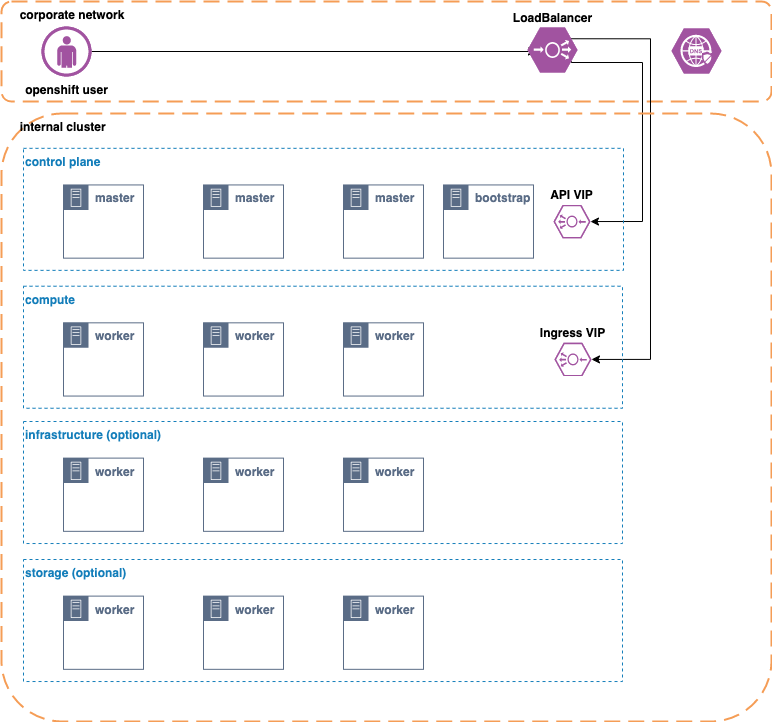

# OpenShift 4.6 UPI Deployment with Static IPs

Deploy OpenShift 4.6 and later using static IP addresses for CoreOS nodes. The `ignition` module will inject code into the cluster that will automatically approve all node CSRs.  This runs only once at cluster creation.  You can delete the `ibm-post-deployment` namespace once your cluster is up and running.

**NOTE**: This requires OpenShift 4.6 or later to deploy, if you're looking for 4.5 or earlier, take a look at the `pre-4.6` [branch](https://github.com/ibm-cloud-architecture/terraform-openshift4-vmware/tree/pre-4.6)

**NOTE**: Requires terraform 0.13 or later.

## Architecture

OpenShift 4.6 User-Provided Infrastructure



## Prereqs

1. [DNS](https://docs.openshift.com/container-platform/4.6/installing/installing_vsphere/installing-vsphere.html#installation-dns-user-infra_installing-vsphere) needs to be configured for external cluster access.
    - api.`cluster_id`.`base_domain` points to `openshift_api_virtualip`
    - *.apps.`cluster_id`.`base_domain` points to `openshift_ingress_virtualip`
    - Point both of those DNS A or CNAME records to your LoadBalancers
2. [CoreOS OVA](http://mirror.openshift.com/pub/openshift-v4/dependencies/rhcos/) must be uploaded to vCenter as a template.

## Installation Process

```bash
git clone https://github.com/ibm-cloud-architecture/terraform-openshift4-vmware
cd terraform-openshift4-vmware
```

Update your `terraform.tfvars` with your environment values.  See `terraform.tfvars.example`

```bash
terraform init
terraform plan
terraform apply
```

## terraform variables

| Variable                         | Description                                                  | Type   | Default |
| -------------------------------- | ------------------------------------------------------------ | ------ | ------- |
| vsphere_server                   | FQDN or IP Address of your vSphere Server                    | string | - |
| vsphere_user                     | vSphere username                                             | string | - |
| vsphere_password                 | vSphere password                                             | string | - |
| vsphere_datacenter               | vSphere Datacenter where OpenShift will be deployed          | string | - |
| vsphere_cluster                  | vSphere Cluster where OpenShift will be deployed             | string | - |
| vsphere_datastore                | vSphere Datastore for OpenShift nodes                        | string | - |
| vsphere_folder                   | The relative path to the folder which should be used or created for VMs. | string | - |
| vsphere_preexisting_folder       | If false, creates a top-level folder with the name from vsphere_folder. | bool   | false |
| vsphere_resource_pool            | The resource pool that should be used or created for VMs     | string | - |
| vsphere_preexisting_resourcepool | If false, creates a resource pool for OpenShift nodes        | bool   | - |
| vm_template                      | Name of CoreOS OVA template from prereq #2                   | string | - |
| vm_network                       | vSphere Network for OpenShift nodes                          | string | - |
| vm_dns_addresses                 | List of DNS servers to use for your OpenShift Nodes          | list   | 8.8.8.8, 8.8.4.4 |
| vm_gateway                       | IP Address of default gateway.  If not set, defaults to first host in machine_cidr | string | null |
| cluster_id                       | This cluster id must be of max length 27 and must have only alphanumeric or hyphen characters. | string | - |
| base_domain                      | Base domain for your OpenShift Cluster                       | string | - |
| machine_cidr                     | CIDR for your CoreOS VMs in `subnet/mask` format.            | string | - |
| bootstrap_ip_address             | IP Address for bootstrap node                                | string | - |
| control_plane_ip_addresses       | List of IP addresses for your control plane nodes            | list   | - |
| control_plane_count              | Number of control plane VMs to create                        | string | 3 |
| control_plane_memory             | Memory, in MB, to allocate to control plane VMs              | string | 16384 |
| control_plane_num_cpus           | Number of CPUs to allocate for control plane VMs             | string | 4 |
| compute_ip_addresses             | List of IP addresses for your compute nodes                  | list   | - |
| compute_count                    | Number of compute VMs to create                              | string | 3|
| compute_memory                   | Memory, in MB, to allocate to compute VMs                    | string | 8192 |
| compute_num_cpus                 | Number of CPUs to allocate for compute VMs                   | string | 3 |
| storage_ip_addresses             | List of IP addresses for your storage nodes                   | list | `Empty` |
| storage_count                    | Number of storage VMs to create                               | string | 0 |
| storage_memory                   | Memory, in MB to allocate to storage VMs                     | string | 65536 |
| storage_num_cpus                 | Number of CPUs to allocate for storage VMs                   | string | 16 |
| openshift_pull_secret            | Path to your OpenShift [pull secret](https://cloud.redhat.com/openshift/install/vsphere/user-provisioned) | string | -                |
| openshift_cluster_cidr           | CIDR for pods in the OpenShift SDN                           | string | 10.128.0.0/14 |
| openshift_service_cidr           | CIDR for services in the OpenShift SDN                       | string | 172.30.0.0/16 |
| openshift_host_prefix            | Controls the number of pods to allocate to each node from the `openshift_cluster_cidr` CIDR. For example, 23 would allocate 2^(32-23) 512 pods to each node. | string | 23 |
| openshift_version                | Version of OpenShift to install. 4.6 or later.               | string | 4.6 |
| create_openshift_vips            | Create the ingressVIP and apiVIP on nodes (same as IPI).     | bool   | true |
| openshift_api_virtualip          | The IP Address that will be used for the `api` LoadBalanced endpoint.  Must be on the same CIDR range as the master nodes | string | - |
| openshift_ingress_virtualip      | The IP Address that will be used for the `*.apps` LoadBalanced endpoint.  Must be on the same CIDR range as the worker nodes | string | - |
| ssh_public_key                   | Path to your ssh public key.  If left blank we will generate one. | string | - |
