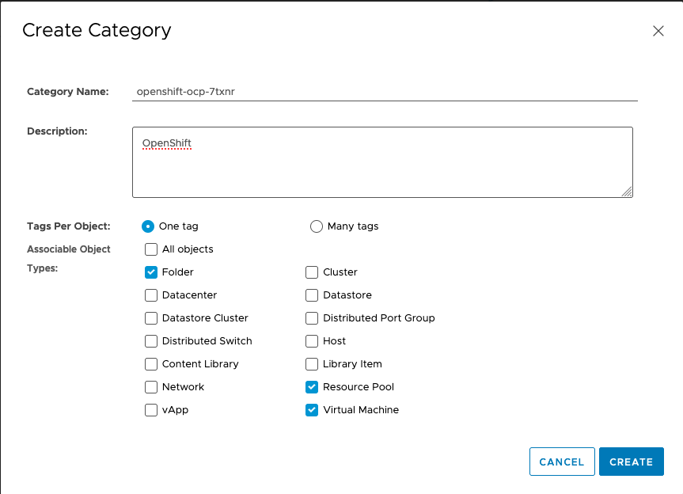
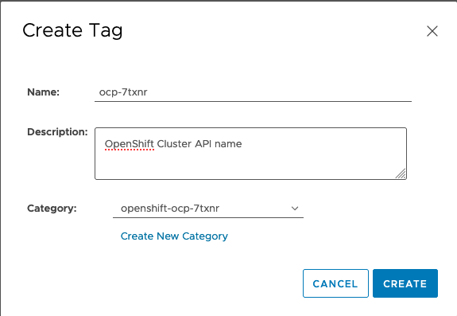

# Add additional nodes as Workers/Infra/Storage

To enable [MachineSets](https://docs.openshift.com/container-platform/4.7/machine_management/creating_machinesets/creating-machineset-vsphere.html) for vSphere UPI Deployments, you will first need to create a Tag inside your vCenter instance based on the Cluster API name. This tag is utilised by the MachineSet to associate the OpenShift Nodes to the provisioned Virtual Machines.

Retrieve the Cluster API name

```bash
oc get infrastructure cluster -o jsonpath='{.status.infrastructureName}{"\n"}'

$ ocp-7txnr
```

Using the Cluster API name, create a category in your vSphere console



then add your Cluster API name tag to that category



Create a new `MachineSet` with a similar definition to below, replacing values to those that match your environment and apply it to the cluster.

```yaml
apiVersion: machine.openshift.io/v1beta1
kind: MachineSet
metadata:
  creationTimestamp: null
  labels:
    machine.openshift.io/cluster-api-cluster: <Cluster API Name>
  name: <MachineSet Name>
  namespace: openshift-machine-api
spec:
  replicas: <Number of Replicas>
  selector:
    matchLabels:
    machine.openshift.io/cluster-api-cluster: <Cluster API Name>
    machine.openshift.io/cluster-api-machineset: <MachineSet Name>
template:
  metadata:
    creationTimestamp: null
    labels:
      machine.openshift.io/cluster-api-cluster: <Cluster API Name>
      machine.openshift.io/cluster-api-machine-role: worker # e.g. worker, infra, master
      machine.openshift.io/cluster-api-machine-type: worker # e.g. worker, infra, master
      machine.openshift.io/cluster-api-machineset: <MachineSet Name>
    spec:
    metadata:
      creationTimestamp: null
    providerSpec:
      value:
      apiVersion: vsphereprovider.openshift.io/v1beta1
      credentialsSecret:
        name: vsphere-cloud-credentials
      diskGiB: <VM Disk Size>
      kind: VSphereMachineProviderSpec
      memoryMiB: <VM RAM Amount>
      metadata:
        creationTimestamp: null
      network:
        devices:
        - networkName: "<VM Network Name>"
      numCPUs: <VM CPU Amount>
      numCoresPerSocket: 1
      snapshot: ""
      template: <VM Template Name>
      userDataSecret:
        name: worker-user-data
      workspace:
        datacenter: <vCenter DataCenter Name>
        datastore: <vCenter Datastore Name>
        folder: <Path to VM Folder in vCenter> # e.g. /DC/vm/ocp45-2tdrm
        resourcepool: <vCenter Resource Pool>
        server: <vCenter Server FQDN/IP>
```

Alternatively, you can use the `99_openshift-cluster-api_worker-machineset-0.yaml` located within the `installer/<cluster_id>` folder, modify the template field to point to your RHCOS template and apply that instead. You can now scale additional nodes automatically just like an IPI deployment.
